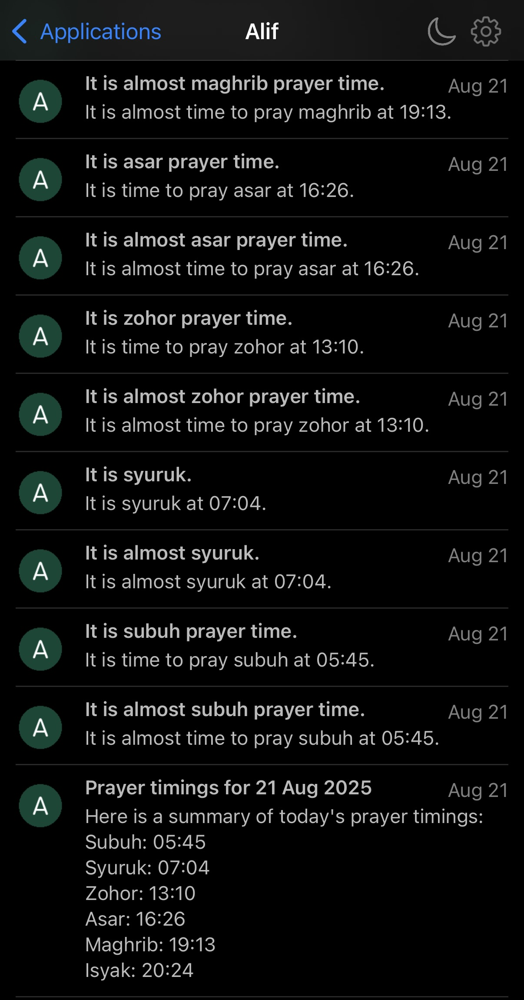

# Alif

A personal pious companion.

Built using Spring Boot + Java for the backend and Pandas + Python for data wrangling.

## Motivation

I needed an app to notify prayer timings but most apps are riddled with ads and poor UX. I also wanted to have an overview and 'pre-prayer' reminders. I would like to extend further with daily random quotes and use LLM to make it personalized. I also thought it would be nice to have a personalized agent using RAG from verified sources.

## Screenshots

